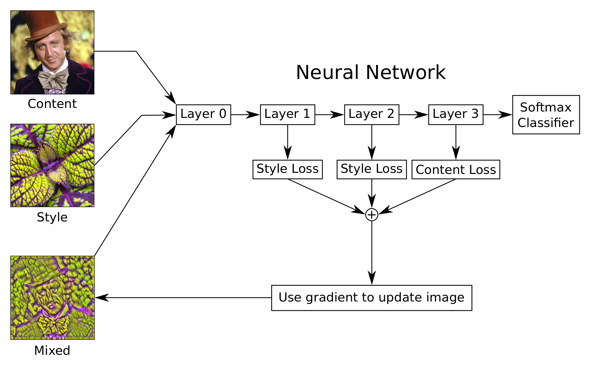
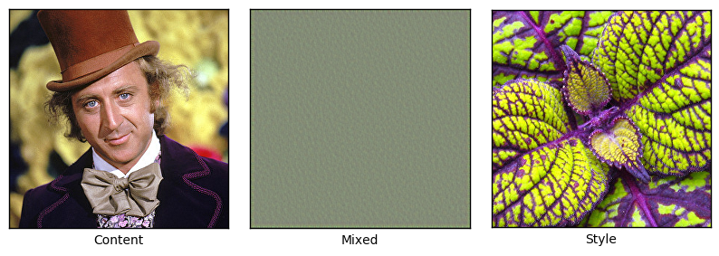
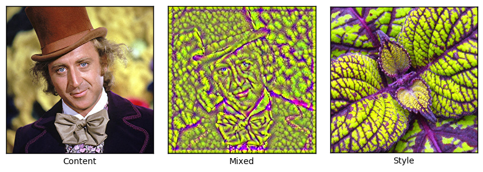
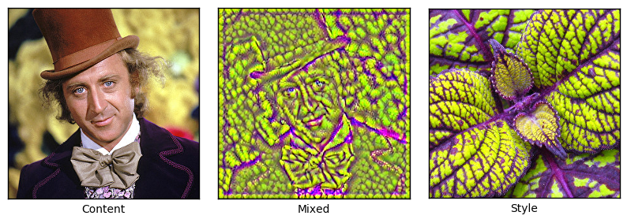
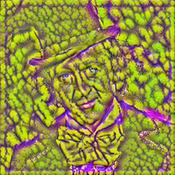

# TensorFlow Tutorial
# Style Transfer

This is my version of the style transfer tensorflow tutorial
by [Magnus Erik Hvass Pedersen](http://www.hvass-labs.org/)
/ [GitHub](https://github.com/Hvass-Labs/TensorFlow-Tutorials) / [Videos on YouTube](https://www.youtube.com/playlist?list=PL9Hr9sNUjfsmEu1ZniY0XpHSzl5uihcXZ)

## Flowchart

This flowchart shows roughly the idea of the Style Transfer algorithm, although we use the VGG-16 model which has many more layers than shown here.

Two images are input to the neural network: A content-image and a style-image. We wish to generate the mixed-image which has the contours of the content-image and the colours and texture of the style-image.
We do this by creating several loss-functions that can be optimized.

The loss-function for the content-image tries to minimize the difference between the features that are activated for the content-image and for the mixed-image, at one or more layers in the network. This causes the contours of the mixed-image to resemble those of the content-image.

The loss-function for the style-image is slightly more complicated, because it instead tries to minimize the difference between the so-called Gram-matrices for the style-image and the mixed-image. This is done at one or more layers in the network. The Gram-matrix measures which features are activated simultaneously in a given layer. Changing the mixed-image so that it mimics the activation patterns of the style-image causes the colour and texture to be transferred.

We use TensorFlow to automatically derive the gradient for these loss-functions. The gradient is then used to update the mixed-image. This procedure is repeated a number of times until we are satisfied with the resulting image.

There are some details of the Style Transfer algorithm not shown in this flowchart, e.g. regarding calculation of the Gram-matrices, calculation and storage of intermediate values for efficiency, a loss-function for denoising the mixed-image, and normalization of the loss-functions so they are easier to scale relative to each other.



## Dependecies for this project

```python
%matplotlib inline
import matplotlib.pyplot as plt
import tensorflow as tf
import numpy as np
import PIL.Image
```

This was developed using Python 3.5.2 (Anaconda) and TensorFlow version:

    '0.11.0rc0'

## VGG-16 Model

After having spent 2 days trying to get the style-transfer algorithm to work with the Inception 5h model that we used for DeepDreaming in Tutorial #14, I could not produce images that looked any good. This seems strange because the images that were produced in Tutorial #14 looked quite nice. But recall that we also used a few tricks to achieve that quality, such as smoothing the gradient and recursively downscaling and processing the image.

The [original paper](https://arxiv.org/abs/1508.06576) on style transfer used the VGG-19 convolutional neural network. But the pre-trained VGG-19 models for TensorFlow did not seem suitable for this tutorial for different reasons. Instead we will use the VGG-16 model, which someone else has made available and which can easily be loaded in TensorFlow. We have wrapped it in a class for convenience.

## Loss Functions

These helper-functions create the loss-functions that are used in optimization with TensorFlow.

This function creates a TensorFlow operation for calculating the Mean Squared Error between the two input tensors.

    Content layers:
    ['conv3_1/conv3_1']
    
    Style layers:
    ['conv1_1/conv1_1', 'conv1_2/conv1_2', 'conv2_1/conv2_1', 'conv2_2/conv2_2', 'conv3_1/conv3_1', 'conv3_2/conv3_2', 'conv3_3/conv3_3', 'conv4_1/conv4_1', 'conv4_2/conv4_2', 'conv4_3/conv4_3', 'conv5_1/conv5_1', 'conv5_2/conv5_2', 'conv5_3/conv5_3']
    
    . 
    Iteration: 0
    Weight Adj. for Content: 5.18e-11, Style: 2.14e-29, Denoise: 5.61e-06
    





    . . . . . . . . . . 
    Iteration: 10
    Weight Adj. for Content: 2.79e-11, Style: 4.13e-28, Denoise: 1.25e-07
    


    . . . . . . . . . . 
    Iteration: 20
    Weight Adj. for Content: 2.63e-11, Style: 1.09e-27, Denoise: 1.30e-07
    





    . . . . . . . . . . 
    Iteration: 30
    Weight Adj. for Content: 2.66e-11, Style: 1.27e-27, Denoise: 1.27e-07
    





    . . . . . . . . . . 
    Iteration: 40
    Weight Adj. for Content: 2.73e-11, Style: 1.16e-27, Denoise: 1.26e-07
    


    . . . . . . . . . . 
    Iteration: 50
    Weight Adj. for Content: 2.75e-11, Style: 1.12e-27, Denoise: 1.24e-07
    


    . . . . . . . . . 
    Iteration: 59
    Weight Adj. for Content: 1.85e-11, Style: 3.86e-28, Denoise: 1.01e-07
    


    
    Final image:
    





    CPU times: user 20min 1s, sys: 45.5 s, total: 20min 46s
    Wall time: 3min 4s
    

## Conclusion

This tutorial showed the basic idea of using neural networks for combining the content and style of two images. The results were unfortunately not as pretty as some of the systems that are commercially available, such as [DeepArt](http://www.deepart.io) which was developed by some of the pioneers in these techniques. The reason is unclear. Perhaps we simply need more computational power so we can perform more optimization iterations with smaller step-sizes and for higher-resolution images. Or perhaps we need to use a more sophisticated optimization method. The exercises below give suggestions that may improve the quality and you are encouraged to try them.

## Exercises

These are a few suggestions for exercises that may help improve your skills with TensorFlow. It is important to get hands-on experience with TensorFlow in order to learn how to use it properly.

You may want to backup this Notebook and the other files before making any changes.

Exercises:

* Try using other images. Several style-images are included with these tutorials. You can also try using your own images.
* Try more optimization iterations (e.g. 1000-5000) and smaller step-sizes (e.g. 1.0-3.0). Does it improve the quality?
* Change the weights for the style, content and denoising.
* Try and start the optimization from either the content- or style-image, or perhaps an average of the two. You can also mix in a little noise.
* Try changing the resolution of both the style- and content-images. You can use the `max_size` argument for the `load_image()` function to resize the images. How does it affect the result?
* Try using other layers in the VGG-16 model.
* Modify the source-code so it saves the images e.g. every 10 iterations of the optimization.
* Use constant weights throughout the optimization. Does it affect the result?
* Use different weights for the style-layers. Also try and automatically adjust these weights like the other loss-weights.
* Use the ADAM optimizer from TensorFlow instead of basic gradient descent.
* Use the L-BFGS optimizer. This is not currently implemented in TensorFlow. Can you get the one from SciPy working with the style-transfer algorithm? Does it improve the result?
* Use other pre-trained neural networks, e.g. the Inception 5h model we used in Tutorial #14, or the VGG-19 model that you can find on the internet.
* Explain to a friend how the program works.

## License (MIT)

Copyright (c) 2016 by [Magnus Erik Hvass Pedersen](http://www.hvass-labs.org/)

Permission is hereby granted, free of charge, to any person obtaining a copy of this software and associated documentation files (the "Software"), to deal in the Software without restriction, including without limitation the rights to use, copy, modify, merge, publish, distribute, sublicense, and/or sell copies of the Software, and to permit persons to whom the Software is furnished to do so, subject to the following conditions:

The above copyright notice and this permission notice shall be included in all copies or substantial portions of the Software.

THE SOFTWARE IS PROVIDED "AS IS", WITHOUT WARRANTY OF ANY KIND, EXPRESS OR IMPLIED, INCLUDING BUT NOT LIMITED TO THE WARRANTIES OF MERCHANTABILITY, FITNESS FOR A PARTICULAR PURPOSE AND NONINFRINGEMENT. IN NO EVENT SHALL THE AUTHORS OR COPYRIGHT HOLDERS BE LIABLE FOR ANY CLAIM, DAMAGES OR OTHER LIABILITY, WHETHER IN AN ACTION OF CONTRACT, TORT OR OTHERWISE, ARISING FROM, OUT OF OR IN CONNECTION WITH THE SOFTWARE OR THE USE OR OTHER DEALINGS IN THE SOFTWARE.
