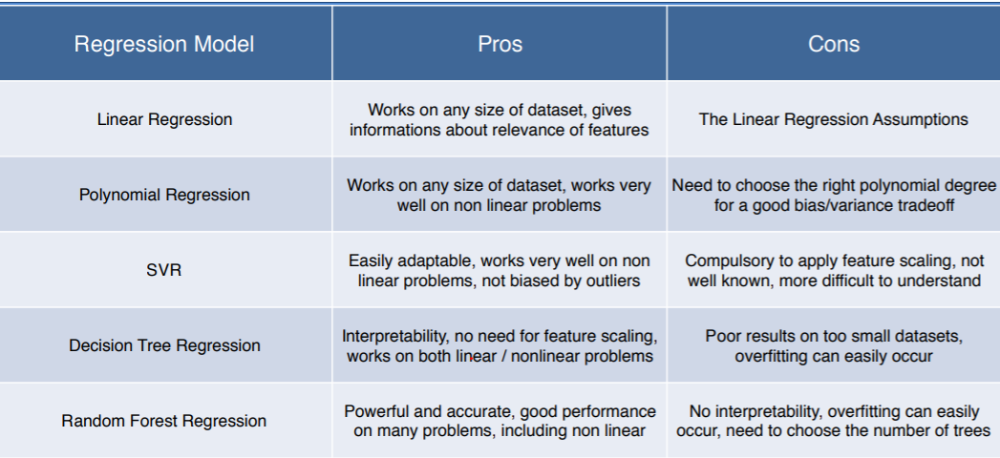

<body class="c7">

<h2 class="c5" id="h.ei2sicgni5bj">Introduction:</h2>
Regression models (both linear and non-linear) are used for predicting a real value, like salary for example. If your independent variable is time, then you are forecasting future values, otherwise your model is predicting present but unknown values. Regression technique vary from Linear Regression to SVR and Random Forests Regression.

In this folder contains basic implement the following Machine Learning Regression models:
<ol class="c6 lst-kix_53rx3v4t0qia-0 start" start="1"><li class="c0">Simple Linear Regression</li><li class="c0">Multiple Linear Regression</li><li class="c0">Polynomial Regression</li><li class="c0">Support Vector for Regression (SVR)</li><li class="c0">Decision Tree Classification</li><li class="c0">Random Forest Classification</li></ol><h2 class="c5" id="h.p28cmj918t8g">1. What are the pros and cons of each model ?</h2><h2 class="c5" id="h.7elwr51f9vlr">2. How do I know which model to choose for my problem ?</h2>
First, you need to figure out whether your problem is linear or nonlinear. 

If your problem is linear, you should go for Simple Linear Regression if you only have one feature, and Multiple Linear Regression if you have several features.

If your problem is nonlinear, you should go for Polynomial Regression, SVR, Decision Tree or Random Forest. 

The method consists of using a very relevant technique that evaluates your models performance, called k-Fold Cross Validation, and then picking the model that shows the best results.
<h2 class="c5" id="h.i2g1mfns9ah7">3. How can I improve each of these models ?</h2>
You probably already noticed that each model is composed of two types of parameters:
<ul class="c6 lst-kix_nrv9tdgtzxu6-0 start"><li class="c9">the parameters that are learnt, for example the coefficients in Linear Regression,</li><li class="c9">the hyperparameters.</li></ul>
The hyperparameters are the parameters that are not learnt and that are fixed values inside the model equations. For example, the regularization parameter lambda or the penalty parameter C are hyperparameters. So far we used the default value of these hyperparameters, and we haven&#39;t searched for their optimal value so that your model reaches even higher performance. Finding their optimal value is exactly what Parameter Tuning is about. 

Reference:

Machine Learning A-Z

</body></html>